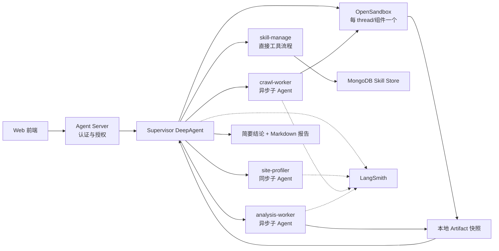

# Deep Data Research Agent 设计说明

> 状态：当前 MVP 使用 Tavily、异步 crawl-worker、Supervisor 直管 Skill、OpenSandbox 与 MongoDB；更新日期：2026-07-31
> 未确认的技术选型以“暂定”标记，后续讨论后更新。
## 1. 项目背景

本项目拟建设一个面向多用户的数据研究与分析 Agent。系统以网页数据采集为首要入口，后续扩展 CSV、Excel、Parquet 等本地数据源。Agent 能够理解自然语言任务、制定计划、采集网页、生成并执行数据分析脚本，最终返回简要结论和完整 Markdown 报告。

项目将深度使用 DeepAgents，而不是只使用其工具调用循环：集成 plan/todo、同步与异步子 Agent、Skills、上下文管理、长期记忆、interrupt、文件后端、沙箱和 LangSmith 观测。
参考项目为 `E:\MyWork\Agent\deepagent`。其 LangGraph 服务、DeepAgent、React `useStream`、todo 和工具卡片可复用，但多用户、安全、持久化和异步任务需要重新设计。

## 2. 建设目标

1. 用户通过自然语言和 URL 发起网页数据研究任务。
2. 系统自动分析站点结构并生成可审阅的采集计划。
3. 用户批准后，后台异步采集网页并生成可追溯数据集。
4. Agent 在隔离沙箱中生成和执行数据分析脚本。
5. 系统返回聊天中的简要结论及完整 Markdown 报告。
6. 所有 Agent、模型、工具、任务和产物均可在 LangSmith 中追踪。
7. 不同组织、用户和会话的数据、线程和记忆严格隔离。

## 3. 非目标

- 首期不提供通用软件开发能力，代码生成仅限数据处理和分析脚本。
- 首期不绕过验证码、付费墙、强反爬或站点访问控制。
- 首期不自动执行不可逆的外部操作。
- 原始网页、大数据集和未验证结论不作为长期记忆。
- 不依赖提示词承担安全边界，权限由认证、工具和沙箱强制执行。

## 4. 核心场景

- 网页结构化采集：识别列表、详情、分页和字段，生成 CSV/Parquet 数据集。
- 多源网页研究：搜索和读取多个网页，整理来源、证据和研究结论。
- 网页数据分析：清洗、去重、类型转换、统计、异常检测和可视化。
- 后续扩展：上传本地表格，并与网页数据合并分析。

## 5. 总体架构

## 6. Agent 设计

### 6.1 Supervisor DeepAgent

- 与用户交互，使用内置 `write_todos` 创建和更新计划。
- 将稳定计划写入 task manifest，支持恢复和审计。
- 调用同步/异步子 Agent，在高风险或高成本动作前触发 interrupt。
- 汇总结构化结果并生成最终 Markdown，仅在沙箱执行必要的数据分析脚本。

### 6.2 site-profiler 同步子 Agent

- 检查少量样本页，判断静态、动态、列表、详情和分页结构。
- 推导字段、抽取方式、成本、风险与停止条件。
- 生成结构化 `CrawlSpec`，供用户审批和 crawl-worker 执行。

### 6.3 crawl-worker 异步子 Agent

- 根据已批准的 `CrawlSpec` 执行长时间采集。
- 支持启动、查询进度、追加指令和取消。
- 实施域名限制、限速、重试、去重和内容大小限制。
- 保存原始响应、抽取数据、来源和错误记录。
- 返回数据集引用和 `CrawlResult`，不返回完整网页正文。

### 6.4 analysis-worker 异步子 Agent

- 读取数据集，执行数据质量检查。
- 生成仅限数据分析用途的 Python/SQL 脚本。
- 在隔离沙箱执行脚本并验证结果。
- 生成统计、图表、日志和 `AnalysisResult`。
- 不修改项目代码，不访问未批准的网络和文件。

## 7. DeepAgents 能力集成

| 能力 | 设计 |
|---|---|
| Plan | `write_todos` 展示实时计划，task manifest 保存稳定计划 |
| Skills | 内置 Skill 同步到沙箱；MongoDB active Skill 只读恢复并按需加载 |
| Subagent | site-profiler 后续使用同步子 Agent；Skill 管理不使用子 Agent |
| Async Subagent | crawl-worker、analysis-worker 使用 Agent Protocol |
| Context | 对话、state、workspace、artifact、memory 分层管理 |
| Memory | MongoDB StoreBackend 保存用户动态 Skill；通用记忆后续实现 |
| Interrupt | 审批采集范围、登录态、成本、联网和共享记忆写入 |
| Backend | 全部 Agent 使用 OpenSandbox 默认后端，State/内置 Skills/持久化 Skills 独立路由 |
| Sandbox | Supervisor 联网（Skill 下载/安装）；crawl 禁网；Tavily 请求始终宿主进程 |
| Streaming | 流式输出消息、todo、工具、进度和 interrupt |
| Observability | LangSmith 自动 tracing 加业务自定义 spans |

## 8. Skills 规划

- `task-orchestration`：任务拆分、停止条件、失败恢复和验收。
- `site-profiling`：页面类型、分页、字段和采集策略。
- `responsible-crawling`：robots、限速、域名约束和合规。
- `structured-extraction`：结构化抽取、校验、去重和来源记录。
- `data-quality-analysis`：缺失、异常、类型和统计验证。
- `evidence-reporting`：证据引用、局限说明和 Markdown 报告。

内置 Skills 随代码只读发布并同步到沙箱；Supervisor 读取统一 `skill-manage` 后在默认 OpenSandbox 的 `/skill-manage/` 创建或下载 Skill、用 `execute` 测试，再通过单个 `assign_skill` 一步分配并持久化，不创建 Skill 专用 LangGraph 或子智能体。用户 Skill 写入 MongoDB active 目录，于每轮恢复到目标沙箱。下载依赖已联网的 supervisor 沙箱，解压拒绝路径穿越与链接。

## 9. 上下文与长期记忆

- Runtime Context：`org_id`、`user_id`、角色、请求 ID 和权限。
- Graph State：当前计划、job ID、artifact 引用和 interrupt 状态。
- Thread：连续对话历史和短期 scratch 文件。
- Workspace：当前任务的代码、临时文件和输出。
- Artifact：原始网页、数据集、日志、图表、脚本和报告。
- Long-term Memory：用户偏好、已确认网站规则和使用习惯。

用户记忆按 `(assistant_id, org_id, user_id)` 隔离；组织政策按 `org_id` 共享但只读。网页内容、未验证结论和模型内部推理不得自动写入长期记忆。

## 10. 文件与数据产物

- `task_manifest.json`：目标、计划、状态和任务关系。
- `crawl_spec.json`：批准后的采集范围和字段。
- 原始响应文件及内容哈希。
- CSV/Parquet 数据集及 `dataset_manifest.json`。
- 数据分析脚本、执行日志和图表。
- `final_report.md`：完整报告、证据、局限和来源。

大文件存入 Artifact Store，Agent state 和 ToolMessage 只保存摘要与引用。

## 11. 多用户、安全与 HITL

- 生产身份读取 LangGraph Server 认证用户；开发环境使用显式 `LOCAL_DEV_USER_ID` 回退。
- Agent Server 按 metadata 校验 thread、run、assistant 和 store 权限。
- 身份字段由服务端 Runtime Context 注入，禁止模型自行生成。
- URL 访问必须防止 SSRF、内网地址访问和危险重定向。
- Cookie、API Key 和 Authorization 不得进入模型上下文、沙箱或 trace。
- 用户批准 `CrawlSpec` 后，范围内普通抓取无需逐页中断。
- 登录态、范围扩张、成本超限、联网分析和共享记忆写入必须中断。
- 生产环境禁止直接使用无隔离的 LocalShellBackend。

## 12. 模型接入

模型采用国内 OpenAI-compatible API，具体供应商和模型待定。系统需提供模型注册和兼容层，不能把 `ChatOpenAI + base_url` 视为完整兼容。

上线前必须验证工具调用、并行调用、流式输出、结构化输出、超时和 reasoning 字段。复杂结构化结果优先使用经过验证的 JSON Schema 或 ToolStrategy。

## 13. LangSmith 观测

- 项目按 development、staging、production 环境区分。
- Trace metadata 包含 org、user、thread、task、job、artifact 和 Agent 名称。
- 记录模型、prompt、skill、应用版本、沙箱和数据 manifest 哈希。
- 同步子 Agent 在主 trace 中嵌套；异步子 Agent 使用分布式 trace 或 job ID 关联。
- 自定义 span 覆盖 plan、fetch、parse、validate、artifact 和 analysis。
- Trace 不记录完整 HTML、大数据集、Cookie、密钥和签名 URL。
- 生产环境使用脱敏、条件 tracing、采样、反馈和在线评测。

## 14. 暂定技术选型

- Python 3.13，uv 管理依赖，DeepAgents 暂定 `>=0.6.12,<0.7`。
- 服务使用 LangGraph Agent Server；开发期使用 `langgraph dev`。
- 部署暂定 LangSmith Deployment，保留自托管 Agent Server 方案。
- 沙箱首版采用 OpenSandbox 与官方 `OpensandboxBackend`，不增加自定义协议适配层。
- 分析使用 DuckDB、Polars、pandas、PyArrow。
- MVP 采集使用 Tavily Search/Crawl/Extract；自建抓取与 Playwright 后续再评估。
- 用户动态 Skill 使用 MongoDB StoreBackend；checkpointer 仍沿用 Agent Server 默认实现。
- Artifact 暂定 S3/MinIO 兼容对象存储。
- 前端已使用 React + `@langchain/react` 的 `useStream`，呈现消息、todo、工具卡片和异步任务轨迹。

## 15. MVP 验收流程

1. 用户向 Supervisor 提交自然语言网页研究任务。
2. Supervisor 创建 todo 并异步启动 ASGI crawl-worker。
3. Supervisor 立即返回完整 task ID，不在当前轮轮询。
4. crawl-worker 初始化独立 OpenSandbox，再使用 Tavily 采集公开网页。
5. crawl-worker 保存来源和正文片段，生成带引用的初步分析。
6. 用户查询任务状态，Supervisor 获取最新 Worker 结果。
7. Supervisor 返回简要结论和完整 `final_report.md`。
8. LangSmith 可分别追踪 Supervisor、Worker、工具和模型。
9. Agent 成功后导出 `/workspace`，本地产物按 thread ID 和组件隔离。

## 16. 后续待确认

- 单组织多用户或多企业租户。
- 国内模型供应商、具体模型和 reasoning 模式。
- LangSmith Cloud、自托管或混合部署方式。
- 沙箱供应商、生命周期和费用限制。
- 首版是否支持登录态网页。
- 最大页数、任务时长、并发和数据规模。
- 用户数据及 trace 的合规、保留和脱敏策略。
